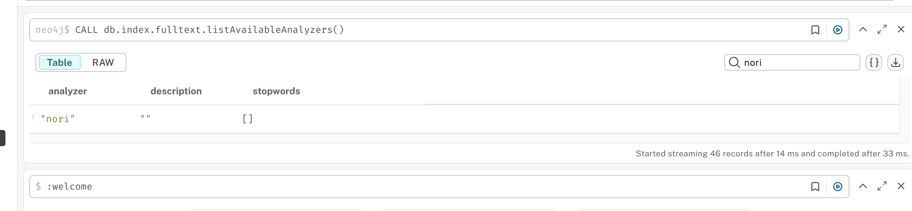

# 1. Neo4J Desktop 환경 설정

## 다운로드 및 설치: 
    https://neo4j.com/download/
    - 새 프로젝트 생성 및 DBMS 추가
    - 초기 셋팅 시 Neo4J 5.24.2 선택

### APOC 플러그인 설정: 
    - APOC 플러그인을 설치하려는 데이터베이스가 있는 프로젝트(Graph DBMS)를 선택
    - Graph DBMS 메뉴 클릭하고, APOC 플러그인(Plugin) 설치

### 설정 파일 수정: 데이터베이스를 중지 후 데이터베이스 카드의 오른쪽에 있는 `...` (메뉴) 버튼을 클릭
    - 메뉴에서 Settings 선택하고 다음 내용을 찾아서 수정(`neo4j.conf` 파일)
    ```
    dbms.security.procedures.unrestricted=apoc.meta.*,apoc.*
    dbms.security.procedures.allowlist=apoc.meta.*,apoc.*
    ```

### nori 형태소 분석기 설치: 
    - 메뉴에서 Open - Instance Foler 선택하고 다음 파일을 이동하여 저장
        - `neo4j-nori-analyzer.jar` 파일을 Neo4j의 `plugins` 폴더에 복사
    - Neo4J Query 도구를 실행하고 다음의 Cypher 쿼리를 실행하고 'nori' 토크나이저를 목록에서 확인
    ```cypher
    CALL db.index.fulltext.listAvailableAnalyzers()
    ```
